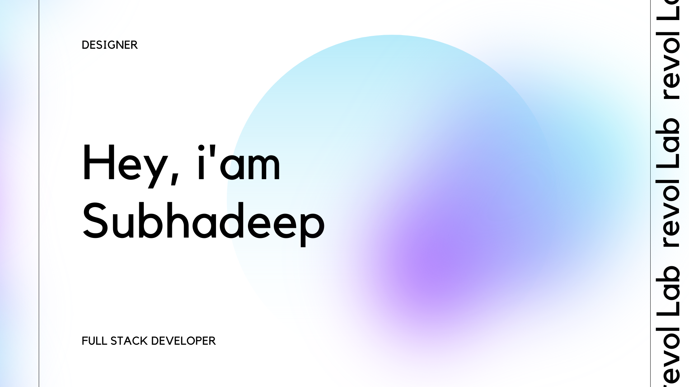

<!--<h1 align="center" >Hey, folks!-->
</h1>

## About Me 👋

I’m a Full Stack developer with a passion for creating modern and minimalist software. I’m currently pursuing CSE in Northeast India and I love collaborating with other developers and designers to learn new things from them. I’m also fascinated by web3 and I’m always open to new opportunities and challenges.

##

- 🔭 I'm currently working on some personal projects using React JS and other web technologies.

- 👨‍💻 I'm currently learning React JS and backend technologies such as Node JS, Express JS, etc.

- 👋 Feel free to ask me anything about front-end development or graphic design. I love to share my knowledge and experience with other folks and students.

- 📧 You can connect with me by my socials. I'd love to hear from you if you're a student or a fellow developer.

## 📫 You can find me on:

## 🎨 Tools I use for design and development purposes are:

## 💻 Some of the technologies I use are: 

##  

